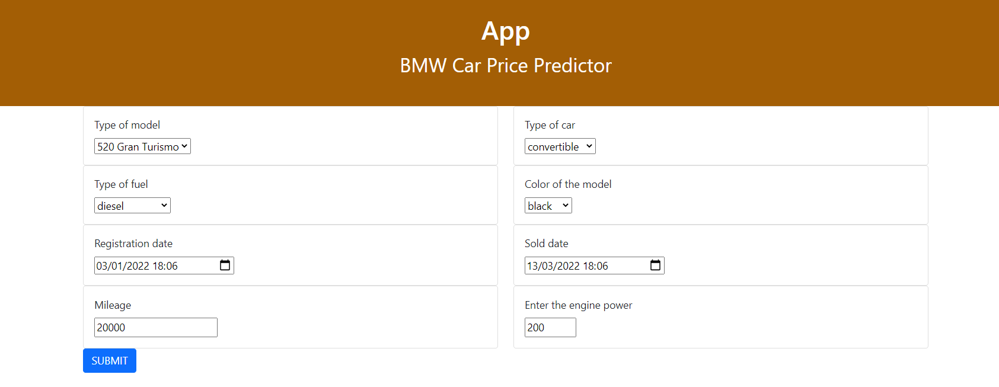

# Car Price Prediction Using FastAPI and XGBoost
Price prediction for a BMW based on its characteristics API using Xgboost for the prediction and FastApi to build the API.

Creation of an API that takes as input the various characteristics of a BMW (model, type of engine, mileage, registration date, date of sale) that returns an estimated price in dollars.
The model was trained on the BMW Pricing Challenge dataset from Kaggle: https://www.kaggle.com/danielkyrka/bmw-pricing-challenge
# Prediction example

## Home Page with the options

## Result of the prediction

